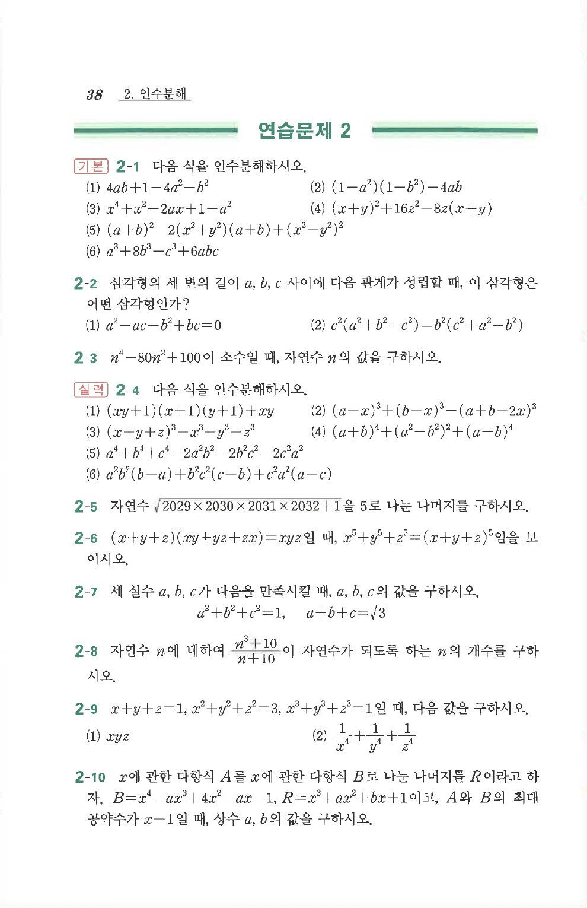

# 연습문제 2-9

## 문제

$x+y+z=1$, $x^2+y^2+z^2=3$, $x^3+y^3+z^3=1$일 때, 다음 값을 구하시오.

1. $$xyz$$
2. $$\frac1{x^4}+\frac1{y^4}+\frac1{z^4}$$

## 정답

1. $xyz=-1$
2. $3$

## 풀이

$x+y+z=1$, $xy+yz+zx=q$, $xyz=r$이라 하면

$$x^2+y^2+z^2=(x+y+z)^2-2(xy+yz+zx)=1-2q=3 \;\Rightarrow\; q=-1$$

$$x^3+y^3+z^3-3xyz=(x+y+z)(x^2+y^2+z^2-xy-yz-zx)=1\cdot(3-(-1))=4$$

$$1-3r=4 \;\Rightarrow\; r=xyz=-1$$

**1.** $xyz=-1$

**2.** $x,y,z$는 삼차방정식 $t^3-t^2+qt-r=t^3-t^2-t+1=0$의 세 근이다.
$$t^3-t^2-t+1=t^2(t-1)-(t-1)=(t-1)^2(t+1)$$
이므로 $x,y,z$는 $1,1,-1$ (순서 상관없이)이다. 따라서
$$\frac1{x^4}+\frac1{y^4}+\frac1{z^4}=\frac1{1^4}+\frac1{1^4}+\frac1{(-1)^4}=1+1+1=3$$

## 원문

