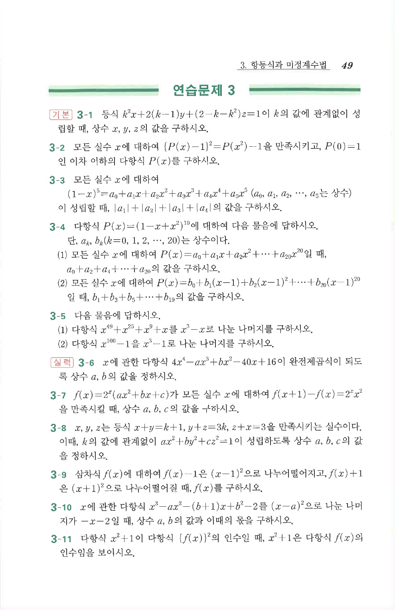

# 연습문제 3-3

## 문제

모든 실수 $x$에 대하여

$$(1-x)^5=a_0+a_1x+a_2x^2+a_3x^3+a_4x^4+a_5x^5$$

($a_0,a_1,a_2,\cdots,a_5$는 상수)이 성립할 때,

$$|a_1|+|a_2|+|a_3|+|a_4|$$

의 값을 구하시오.

## 정답

$$30$$

## 풀이

이항정리에 의해
$$(1-x)^5=\sum_{k=0}^{5}\binom5k(-x)^k=\sum_{k=0}^{5}\binom5k(-1)^kx^k$$

이므로 $a_k=(-1)^k\binom5k$이다. 따라서

$$a_0=1,\ a_1=-5,\ a_2=10,\ a_3=-10,\ a_4=5,\ a_5=-1$$

$$|a_1|+|a_2|+|a_3|+|a_4|=5+10+10+5=30$$

## 원문

