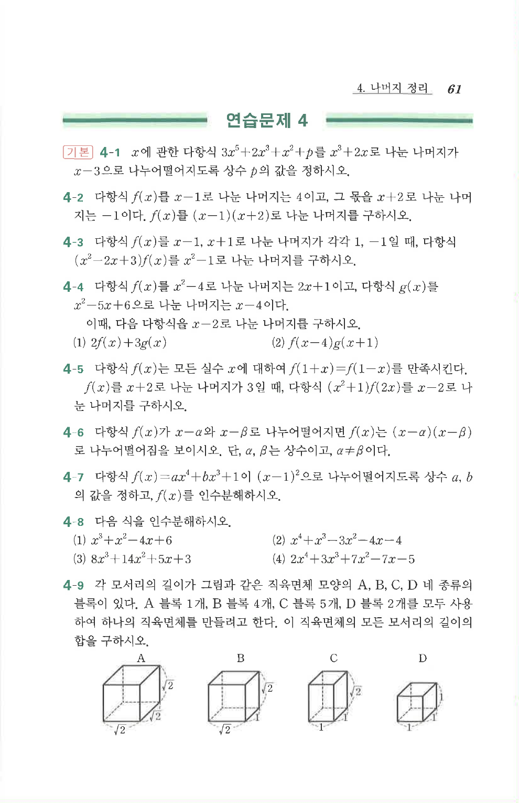

# 연습문제 4-8

## 문제

다음 식을 인수분해하시오.

1. $$x^3+x^2-4x+6$$
2. $$x^4+x^3-3x^2-4x-4$$
3. $$8x^3+14x^2+5x+3$$
4. $$2x^4+3x^3-7x^2-7x-5$$

## 정답

1. $(x+3)(x^2-2x+2)$
2. $(x-2)(x+2)(x^2+x+1)$
3. $(2x+3)(4x^2+x+1)$
4. $(2x+5)(x^3-x^2-x-1)$

## 풀이

**1.**
$f(x)=x^3+x^2-4x+6$에서 $f(-3)=-27+9+12+6=0$이므로 $x+3$이 인수이다.
$$x^3+x^2-4x+6=(x+3)(x^2-2x+2)$$
$x^2-2x+2$의 판별식은 $4-8=-4<0$이므로 더 이상 인수분해되지 않는다.

**2.**
$f(x)=x^4+x^3-3x^2-4x-4$에서 $f(2)=16+8-12-8-4=0$이므로 $x-2$가 인수이고,
$$x^4+x^3-3x^2-4x-4=(x-2)(x^3+3x^2+3x+2)$$
$x^3+3x^2+3x+2$에서 $x=-2$를 대입하면 $-8+12-6+2=0$이므로 $x+2$가 인수이고,
$$x^3+3x^2+3x+2=(x+2)(x^2+x+1)$$
$x^2+x+1$의 판별식은 $1-4=-3<0$이므로 더 이상 인수분해되지 않는다. 따라서
$$x^4+x^3-3x^2-4x-4=(x-2)(x+2)(x^2+x+1)$$

**3.**
$f(x)=8x^3+14x^2+5x+3$에서 $f\left(-\dfrac32\right)=8\left(-\dfrac{27}8\right)+14\left(\dfrac94\right)+5\left(-\dfrac32\right)+3=-27+\dfrac{63}2-\dfrac{15}2+3=0$이므로 $2x+3$이 인수이다.
$$8x^3+14x^2+5x+3=(2x+3)(4x^2+x+1)$$
$4x^2+x+1$의 판별식은 $1-16=-15<0$이므로 더 이상 인수분해되지 않는다.

**4.**
$f(x)=2x^4+3x^3-7x^2-7x-5$에서 $f\left(-\dfrac52\right)=2\left(\dfrac{625}{16}\right)+3\left(-\dfrac{125}8\right)-7\left(\dfrac{25}4\right)-7\left(-\dfrac52\right)-5=0$이므로 $2x+5$가 인수이다.
$$2x^4+3x^3-7x^2-7x-5=(2x+5)(x^3-x^2-x-1)$$
$x^3-x^2-x-1$은 $x=\pm1$을 대입해도 $0$이 되지 않으므로 유리수 인수를 갖지 않는다.

## 원문

