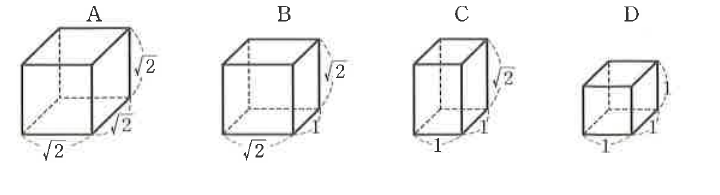

# 연습문제 4-9

## 문제

각 모서리의 길이가 그림과 같은 직육면체 모양의 $A$, $B$, $C$, $D$ 네 종류의 블록이 있다. $A$ 블록 1개, $B$ 블록 4개, $C$ 블록 5개, $D$ 블록 2개를 모두 사용하여 하나의 직육면체를 만들려고 한다. 이 직육면체의 모든 모서리의 길이의 합을 구하시오.

## 도형

블록 $A$는 세 모서리가 모두 $\sqrt2$인 정육면체, $B$는 밑면 한 변이 $\sqrt2$이고 다른 변과 높이가 각각 $1$, $\sqrt2$인 직육면체, $C$는 밑면 두 변이 모두 $1$이고 높이가 $\sqrt2$인 직육면체, $D$는 세 모서리가 모두 $1$인 정육면체로 표시되어 있다.

## 정답

$$16+12\sqrt2$$

## 풀이

블록 $A,B,C$의 세 모서리 중 길이가 $\sqrt2$인 모서리의 개수는 각각 $3,2,1$이고 $D$는 $0$개이다.

만들어질 직육면체의 세 모서리의 길이를 각각 $a_i+b_i\sqrt2$ ($a_i,b_i$는 그 방향에 놓인 $\sqrt2$, $1$ 길이 토막의 개수, $i=1,2,3$)라 하면, 세 방향 중 $j$개가 $\sqrt2$ 토막인 작은 블록의 개수는

- $3$개 모두 $\sqrt2$ (블록 $A$): $a_1a_2a_3=1$
- $2$개가 $\sqrt2$ (블록 $B$): $a_1a_2b_3+a_1b_2a_3+b_1a_2a_3=4$
- $1$개가 $\sqrt2$ (블록 $C$): $a_1b_2b_3+b_1a_2b_3+b_1b_2a_3=5$
- $0$개가 $\sqrt2$ (블록 $D$): $b_1b_2b_3=2$

$a_1a_2a_3=1$이고 $a_i$는 음이 아닌 정수이므로 $a_1=a_2=a_3=1$이다. 이를 대입하면

$$b_1+b_2+b_3=4,\qquad b_1b_2+b_2b_3+b_3b_1=5,\qquad b_1b_2b_3=2$$

즉 $b_1,b_2,b_3$은 삼차방정식 $t^3-4t^2+5t-2=0$의 세 근이다.

$$t^3-4t^2+5t-2=(t-1)^2(t-2)=0$$

이므로 $\{b_1,b_2,b_3\}=\{1,1,2\}$이다. 따라서 직육면체의 세 모서리의 길이는

$$\sqrt2+1,\quad \sqrt2+1,\quad \sqrt2+2$$

(실제로 $(\sqrt2+1)^2(\sqrt2+2)=(3+2\sqrt2)(\sqrt2+2)=10+7\sqrt2$로, 블록들의 부피의 합 $1\cdot2\sqrt2+4\cdot2+5\cdot\sqrt2+2\cdot1=10+7\sqrt2$와 일치한다.)

직육면체는 길이가 같은 모서리가 각각 $4$개씩 있으므로, 모든 모서리의 길이의 합은

$$4\{(\sqrt2+1)+(\sqrt2+1)+(\sqrt2+2)\}=4(3\sqrt2+4)=16+12\sqrt2$$

## 원문

