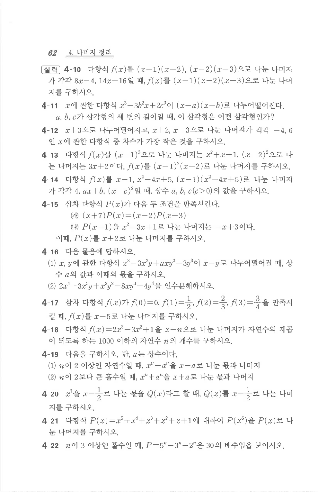

# 연습문제 4-11

## 문제

$x$에 관한 다항식 $x^3-3b^2x+2c^3$이 $(x-a)(x-b)$로 나누어떨어진다. $a,b,c$가 삼각형의 세 변의 길이일 때, 이 삼각형은 어떤 삼각형인가?

## 정답

정삼각형

## 풀이

$f(x)=x^3-3b^2x+2c^3$이 $(x-a)(x-b)$로 나누어떨어지므로 $f(a)=0,\ f(b)=0$.

$$f(b)=b^3-3b^3+2c^3=-2b^3+2c^3=0 \;\Rightarrow\; b^3=c^3 \;\Rightarrow\; b=c$$

($b,c>0$인 실수이므로 세제곱이 같으면 같다.)

$$f(a)=a^3-3b^2a+2c^3=a^3-3b^2a+2b^3$$

$a=b$를 대입하면 $b^3-3b^3+2b^3=0$이므로 $(a-b)$가 인수이다.

$$a^3-3b^2a+2b^3=(a-b)(a^2+ab-2b^2)=(a-b)(a-b)(a+2b)=(a-b)^2(a+2b)$$

$f(a)=0$이고 $a,b>0$이므로 $a+2b>0$이다. 따라서 $(a-b)^2=0$, 즉 $a=b$.

$a=b=c$이므로 이 삼각형은 정삼각형이다.

## 원문

