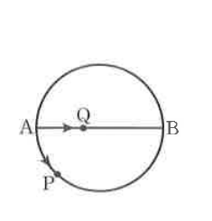

# 연습문제 5-18

## 문제

오른쪽 그림과 같이 동점 $P$는 선분 $AB$를 지름으로 하는 원의 둘레를 시계 반대 방향으로 회전하며, 동점 $Q$는 지름 $AB$ 위를 왕복한다. 두 점 $P$와 $Q$가 동시에 점 $A$를 출발하여 같은 속력으로 움직일 때, 두 점 $P$와 $Q$는 다시 만날 수 없음을 보이시오.

## 도형

선분 $AB$가 원의 지름으로 그려져 있고, 점 $A$는 왼쪽 끝, 점 $B$는 오른쪽 끝에 있다. 점 $P$는 원 둘레 위에서 $A$에서 아래쪽 방향으로 움직이고, 점 $Q$는 지름 $AB$ 위에서 $A$에서 $B$ 방향으로 움직이는 것으로 표시되어 있다.

## 원문

