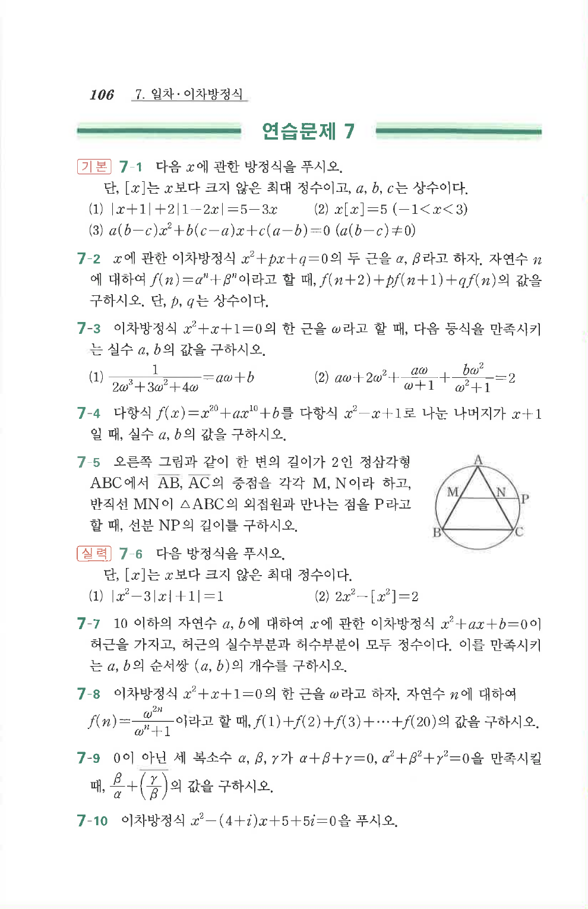

# 연습문제 7-5

## 문제

오른쪽 그림과 같이 한 변의 길이가 $2$인 정삼각형 $ABC$에서 $AB,AC$의 중점을 각각 $M,N$이라 하고, 반직선 $MN$이 $\triangle ABC$의 외접원과 만나는 점을 $P$라고 할 때, 선분 $NP$의 길이를 구하시오.

## 도형

정삼각형 $ABC$가 원에 내접해 있고, $M,N$은 각각 $AB,AC$의 중점이다. 선분 $MN$을 $N$의 오른쪽으로 연장한 반직선이 외접원과 만나는 점이 $P$로 표시되어 있다.

## 원문 문제

## 원문

