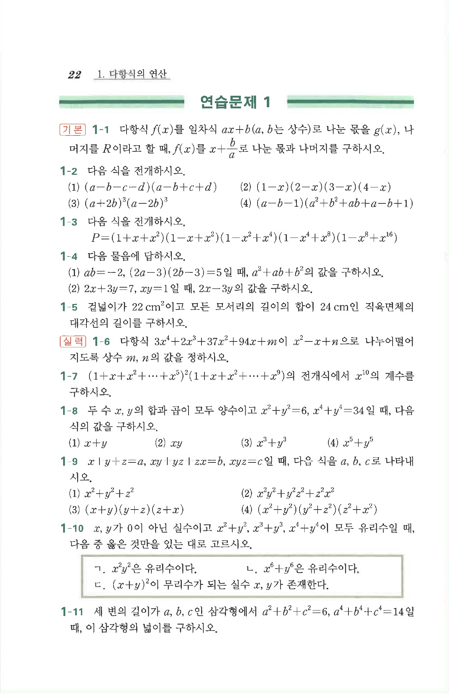

# 연습문제 1-9

## 문제

$x+y+z=a,\ xy+yz+zx=b,\ xyz=c$일 때, 다음 식을 $a,b,c$로 나타내시오.

1. $$x^2+y^2+z^2$$
2. $$x^2y^2+y^2z^2+z^2x^2$$
3. $$(x+y)(y+z)(z+x)$$
4. $$(x^2+y^2)(y^2+z^2)(z^2+x^2)$$

## 정답

1. $a^2-2b$
2. $b^2-2ac$
3. $ab-c$
4. $(a^2-2b)(b^2-2ac)-c^2$

## 풀이

**1.**
$$x^2+y^2+z^2=(x+y+z)^2-2(xy+yz+zx)=a^2-2b$$

**2.**
$$x^2y^2+y^2z^2+z^2x^2=(xy+yz+zx)^2-2xyz(x+y+z)=b^2-2ac$$

**3.**
$$(x+y)(y+z)(z+x)=(x+y+z)(xy+yz+zx)-xyz=ab-c$$

**4.**
$u=x^2+y^2+z^2=a^2-2b$로 놓으면 $x^2+y^2=u-z^2$, $y^2+z^2=u-x^2$, $z^2+x^2=u-y^2$이므로

$$(x^2+y^2)(y^2+z^2)(z^2+x^2)=(u-x^2)(u-y^2)(u-z^2)$$
$$=u^3-u^2(x^2+y^2+z^2)+u(x^2y^2+y^2z^2+z^2x^2)-x^2y^2z^2$$
$$=u^3-u^3+u(b^2-2ac)-c^2=(a^2-2b)(b^2-2ac)-c^2$$

## 원문

