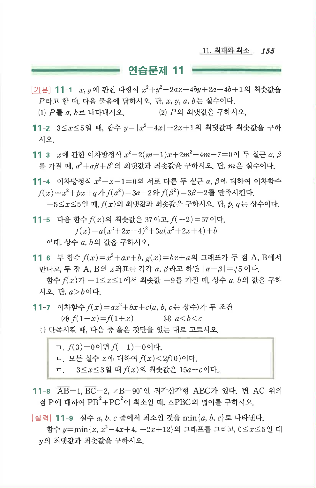

# 연습문제 11-4

## 문제

이차방정식 $x^2+x-1=0$의 서로 다른 두 실근 $\alpha,\beta$에 대하여 이차함수 $f(x)=x^2+px+q$가 $f(\alpha^2)=3\alpha-2$와 $f(\beta^2)=3\beta-2$를 만족시킨다. $-5\le x\le5$일 때, $f(x)$의 최댓값과 최솟값을 구하시오. 단, $p,q$는 상수이다.

## 원문 문제

## 원문

