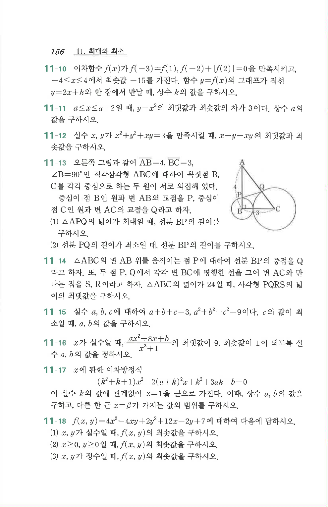

# 연습문제 11-18

## 문제

$f(x,y)=4x^2-4xy+2y^2+12x-2y+7$에 대하여 다음에 답하시오.

1. $x,y$가 실수일 때, $f(x,y)$의 최솟값을 구하시오.
2. $x\ge0$, $y\ge0$일 때, $f(x,y)$의 최솟값을 구하시오.
3. $x,y$가 정수일 때, $f(x,y)$의 최솟값을 구하시오.

## 원문 문제

## 원문

