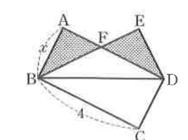

# 연습문제 12-11

## 문제

오른쪽 그림에서 $\square ABCD$는 $AB=x$, $BC=4$인 직사각형이고, $\triangle BCD$와 $\triangle BED$는 서로 합동이다. $\triangle ABF$와 $\triangle EDF$의 넓이의 합이 $3$일 때, 자연수 $x$의 값을 구하시오.

## 도형

$ABCD$는 직사각형이며 $AB=x$, $BC=4$로 표시되어 있다. 점 $E$는 $D$의 위쪽에 있고, 선분 $AD$와 $BE$가 내부에서 만나 점 $F$를 이룬다. 그림에서 음영 처리된 두 삼각형은 $\triangle ABF$와 $\triangle EDF$이다.

## 원문

