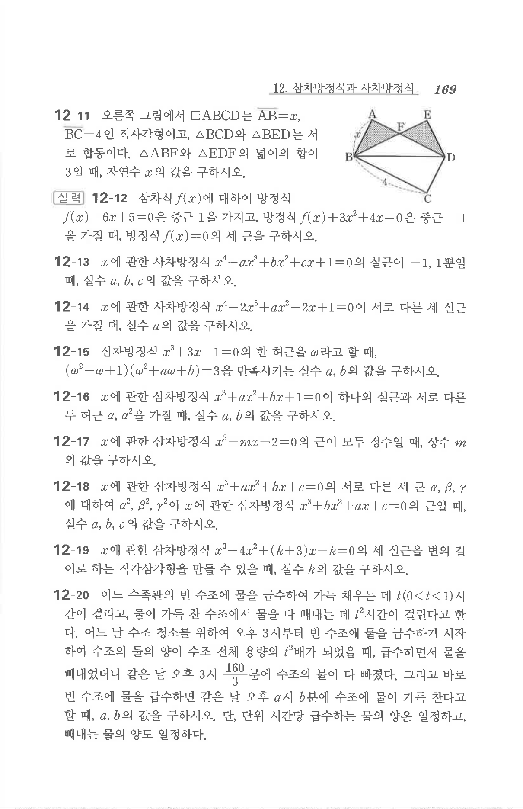

# 연습문제 12-20

## 문제

어느 수족관의 빈 수조에 물을 급수하여 가득 채우는 데 $t(0<t<1)$시간이 걸리고, 물이 가득 찬 수조에서 물을 다 빼내는 데 $t^2$시간이 걸린다고 한다. 어느 날 수조 청소를 위하여 오후 3시부터 빈 수조에 물을 급수하기 시작하여 수조의 물의 양이 수조 전체 용량의 $t^2$배가 되었을 때, 급수하면서 물을 빼내었더니 같은 날 오후 3시 $\frac{160}{3}$분에 수조의 물이 다 빠졌다. 그리고 바로 빈 수조에 물을 급수하면 같은 날 오후 $a$시 $b$분에 수조에 물이 가득 찬다고 할 때, $a,b$의 값을 구하시오. 단, 단위 시간당 급수하는 물의 양은 일정하고, 빼내는 물의 양도 일정하다.

## 원문

