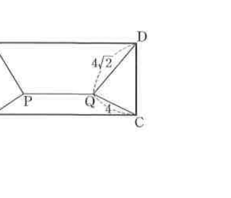

# 연습문제 13-30

## 문제

오른쪽 그림과 같이 직사각형 $ABCD$의 내부에 선분 $PQ$가 변 $AD$에 평행하게 놓여 있다. $QC=4$, $QD=4\sqrt2$일 때, $PA$와 $PB$의 길이를 구하시오. 단, $PA,PB$의 길이는 자연수이다.

## 도형

직사각형 $ABCD$ 안에 수평인 선분 $PQ$가 있고, $P$는 왼쪽 내부, $Q$는 오른쪽 내부에 있다. $P$는 $A,B$와 각각 연결되어 있고 $Q$는 $C,D$와 각각 연결되어 있다. 그림에는 $QC=4$, $QD=4\sqrt2$가 표시되어 있다.

## 원문

