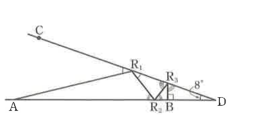

# 연습문제 14-8

## 문제

오른쪽 그림과 같이 점 A에서 나간 빛이 $\overline{AD}$와 $\overline{CD}$ 사이에서 $n$번 반사되어 $\overline{AD}$ 또는 $\overline{CD}$ 위의 점 B에 수직으로 입사하면 점 A로 되돌아온다. 예를 들어 오른쪽 그림은 $n=3$일 때이고, 점 B는 $\overline{AD}$ 위에 있는 경우이다. $\angle ADC=8^\circ$일 때, 점 A에서 나간 빛이 점 A로 되돌아올 수 있는 $n$의 최댓값을 구하시오.

## 도형

선분 $AD$가 수평으로 놓이고, 점 $D$에서 위쪽 왼쪽으로 선분 $CD$가 뻗어 있어 $\angle ADC=8^\circ$이다. 점 $A$에서 출발한 광선이 $CD$ 위의 $R_1$, $AD$ 위의 $R_2$, 다시 $CD$ 위의 $R_3$을 거쳐 $AD$ 위의 점 $B$에 수직으로 입사하는 예시가 그려져 있다.

## 원문

