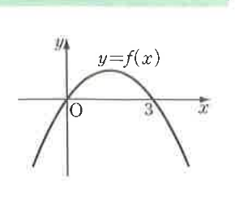

# 연습문제 15-1

## 문제

원점과 점 $(3,0)$을 지나는 이차함수 $y=f(x)$의 그래프가 오른쪽 그림과 같다. 부등식

$$f\left(\frac{x-k}{2}\right)>0$$

의 해가 $-4<x<l$일 때, 상수 $k,l$의 값을 구하시오.

## 도형

아래로 열린 포물선 $y=f(x)$가 $x$축과 원점 및 $(3,0)$에서 만난다. 그래프는 두 근 사이에서 $x$축 위쪽에 있다.

## 원문

