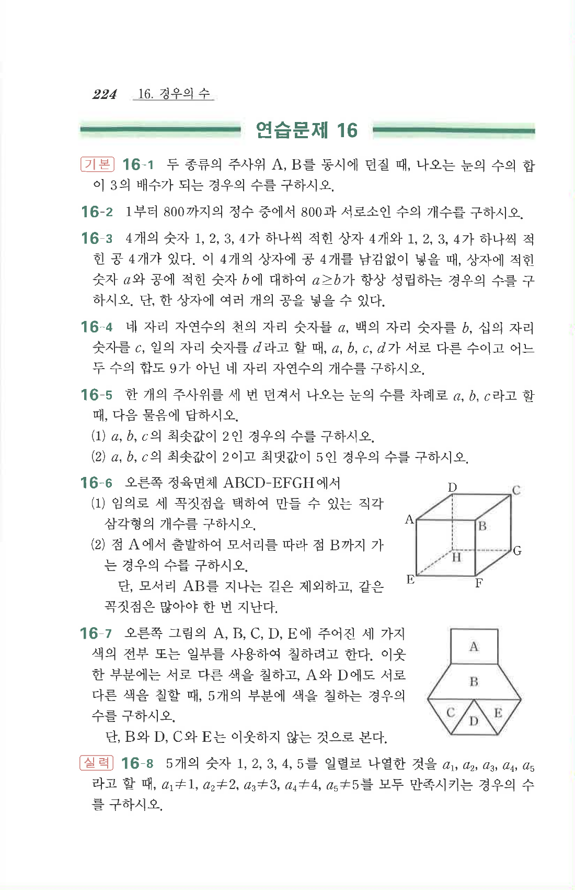

# 연습문제 16-3

## 문제

$4$개의 숫자 $1,2,3,4$가 하나씩 적힌 상자 $4$개와 $1,2,3,4$가 하나씩 적힌 공 $4$개가 있다. 이 $4$개의 상자에 공 $4$개를 남김없이 넣을 때, 상자에 적힌 숫자 $a$와 공에 적힌 숫자 $b$에 대하여 $a\ge b$가 항상 성립하는 경우의 수를 구하시오. 단, 한 상자에 여러 개의 공을 넣을 수 있다.

## 원문

