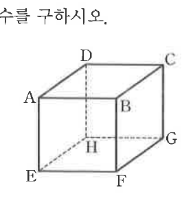

# 연습문제 16-6

## 문제

오른쪽 정육면체 $ABCD-EFGH$에서 다음 물음에 답하시오.

1. 임의로 세 꼭짓점을 택하여 만들 수 있는 직각삼각형의 개수를 구하시오.
2. 점 A에서 출발하여 모서리를 따라 점 B까지 가는 경우의 수를 구하시오. 단, 모서리 $AB$를 지나는 길은 제외하고, 같은 꼭짓점은 많아야 한 번 지난다.

## 도형

정육면체의 위쪽 꼭짓점은 $A,B,C,D$, 아래쪽 꼭짓점은 $E,F,G,H$로 표시되어 있다. 점 A와 B는 앞면 위쪽의 두 꼭짓점이다.

## 원문

