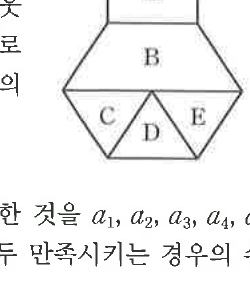

# 연습문제 16-7

## 문제

오른쪽 그림의 A, B, C, D, E에 주어진 세 가지 색의 전부 또는 일부를 사용하여 칠하려고 한다. 이웃한 부분에는 서로 다른 색을 칠하고, A와 D에도 서로 다른 색을 칠할 때, $5$개의 부분에 색을 칠하는 경우의 수를 구하시오. 단, B와 D, C와 E는 이웃하지 않는 것으로 본다.

## 도형

위쪽에 영역 A, 그 아래에 영역 B가 있고, 아래쪽은 C, D, E 세 영역으로 나뉜 도형이다. B와 D, C와 E는 이웃하지 않는 것으로 본다는 조건이 붙어 있다.

## 원문

