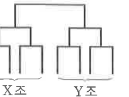

# 연습문제 16-10

## 문제

A, B, C, D의 네 학교에서 각각 $2$명의 테니스 선수가 나와 오른쪽 그림과 같이 X, Y 두 조로 나누어 토너먼트로 시합을 한다. 같은 학교에서 나온 선수는 같은 조가 될 수 없도록 할 때, 만들어질 수 있는 대진표는 몇 가지인가?

## 도형

전체 대진표가 X조와 Y조로 나뉘고, 각 조 안에서 두 경기씩 진행되는 토너먼트 형태이다.

## 원문

