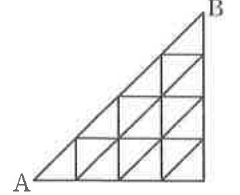

# 연습문제 16-11

## 문제

오른쪽 그림과 같은 길이 있다. A에서 출발하여 B에 도달하는 경우의 수를 다음 각각에 대하여 구하시오.

1. 오른쪽과 위로만 간다.
2. 오른쪽, 위, 오른쪽 위(사선 방향)로만 간다.

## 도형

A에서 B까지 올라가는 직각삼각형 모양의 격자길이다. 내부에는 가로, 세로, 오른쪽 위 방향의 사선 길이 포함되어 있다.

## 원문

