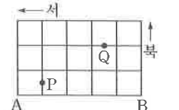

# 연습문제 16-12

## 문제

오른쪽 그림과 같은 길을 따라 A에서 B까지 가는 방법 중 다음을 만족시키는 경우의 수를 구하시오.

1. 먼 거리로 가도 되지만 서쪽으로 가서는 안 되고, 한 번 지나온 길을 다시 지나갈 수는 없다.
2. (1)의 조건을 만족시키고, P와 Q를 지나지 않는다.

## 도형

직사각형 격자길에서 왼쪽 아래가 A, 오른쪽 아래가 B이다. 서쪽과 북쪽 방향 표시가 있고, 내부 격자점 P와 Q가 표시되어 있다.

## 원문

