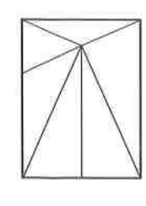

# 연습문제 16-14

## 문제

오른쪽 그림과 같이 직사각형을 $6$개의 삼각형으로 나눈 다음, 빨강, 파랑, 노랑의 세 가지 색을 사용하여 다음 세 조건을 만족시키도록 칠하는 경우의 수를 구하시오.

(가) 각각의 삼각형을 빨강, 파랑, 노랑 중 한 가지 색만으로 칠한다.  
(나) 한 변을 공유하는 두 삼각형을 서로 다른 색으로 칠한다.  
(다) 빨강, 파랑, 노랑 중에서 사용하지 않는 색은 없다.

## 도형

직사각형 내부의 한 점에서 여러 꼭짓점과 아래쪽 중점으로 선분을 그어 전체가 $6$개의 삼각형으로 나누어져 있다.

## 원문

