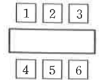

# 연습문제 17-3

## 문제

여섯 국가의 대표 A, B, C, D, E, F가 오른쪽 그림과 같이 직사각형 모양의 탁자를 사이에 두고 숫자 $1,2,3,4,5,6$이 각각 적힌 자리에 앉으려고 한다. 이때, A와 B는 마주 보는 자리에 앉고, C와 D는 이웃하지 않는 자리에 앉는 경우의 수를 구하시오. 단, 마주 보는 자리는 이웃한 자리가 아니다.

## 도형

직사각형 탁자 위쪽에 자리 $1,2,3$, 아래쪽에 자리 $4,5,6$이 있다. 서로 마주 보는 자리쌍은 위아래로 대응하는 자리이다.

## 원문

