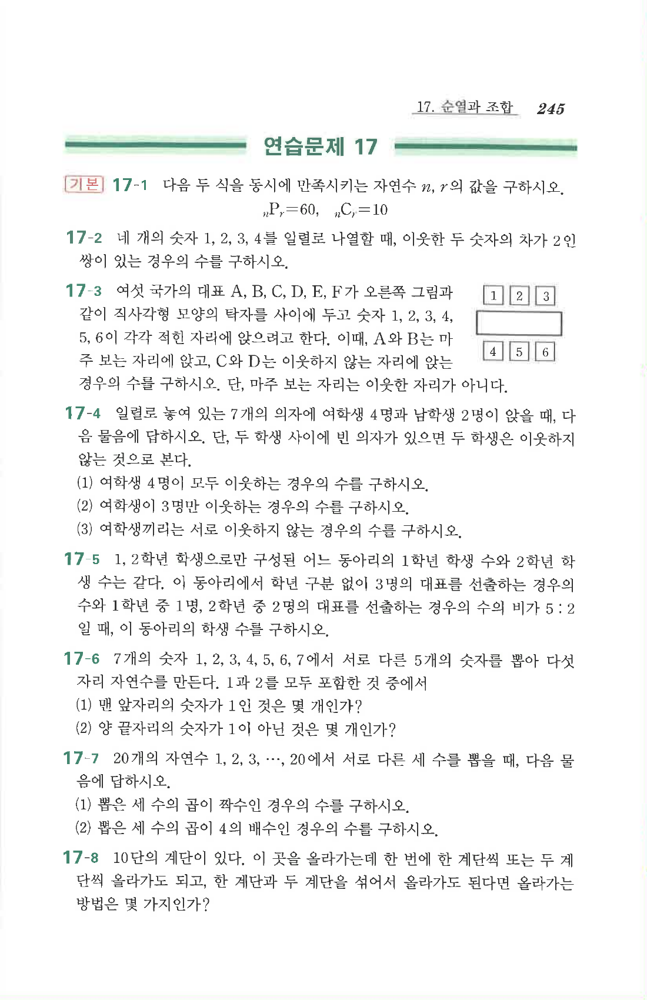

# 연습문제 17-4

## 문제

일렬로 놓여 있는 $7$개의 의자에 여학생 $4$명과 남학생 $2$명이 앉을 때, 다음 물음에 답하시오. 단, 두 학생 사이에 빈 의자가 있으면 두 학생은 이웃하지 않는 것으로 본다.

1. 여학생 $4$명이 모두 이웃하는 경우의 수
2. 여학생이 $3$명만 이웃하는 경우의 수
3. 여학생끼리는 서로 이웃하지 않는 경우의 수

## 원문

