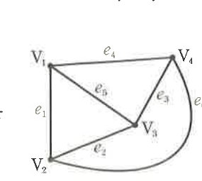

# 연습문제 18-2

## 문제

오른쪽 그림에서 점 $V_i$가 선 $e_j$의 한 끝점이면 $a_{ij}=1$로, 점 $V_i$가 선 $e_j$의 끝점이 아니면 $a_{ij}=0$으로 나타낼 때, $a_{ij}$를 $(i,j)$ 성분으로 하는 행렬 $A=(a_{ij})$를 구하시오. 단, $i=1,2,3,4$, $j=1,2,3,4,5,6$이다.

## 도형

네 점 $V_1,V_2,V_3,V_4$와 여섯 선 $e_1,\ldots,e_6$의 연결 관계가 표시되어 있다. 각 선의 양 끝점에 해당하는 두 성분만 $1$이 된다.

## 원문

