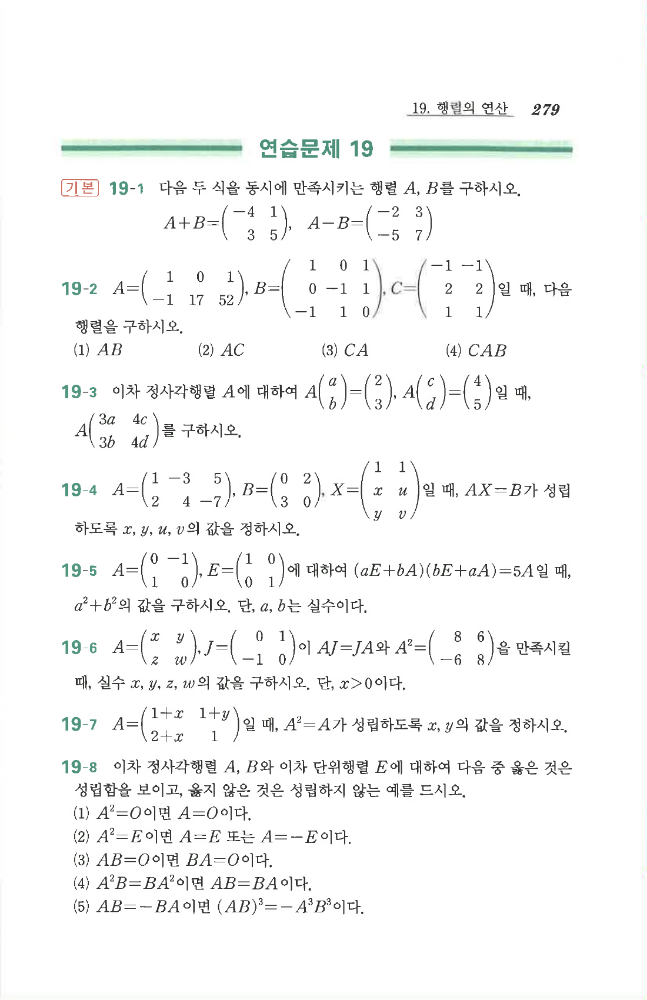

# 연습문제 19-3

## 문제

이차 정사각행렬 $A$에 대하여
$$A\begin{pmatrix}a\\b\end{pmatrix}=\begin{pmatrix}2\\3\end{pmatrix},\quad
A\begin{pmatrix}c\\d\end{pmatrix}=\begin{pmatrix}4\\5\end{pmatrix}$$
일 때,
$$A\begin{pmatrix}3a&4c\\3b&4d\end{pmatrix}$$
를 구하시오.

## 원문

