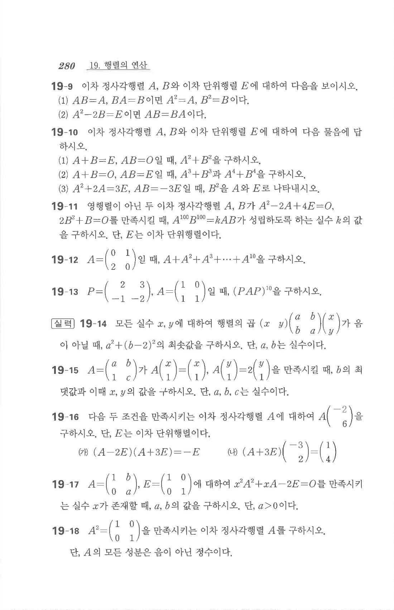

# 연습문제 19-14

## 문제

모든 실수 $x,y$에 대하여 행렬의 곱
$$\begin{pmatrix}x&y\end{pmatrix}\begin{pmatrix}a&b\\b&a\end{pmatrix}\begin{pmatrix}x\\y\end{pmatrix}$$
가 음이 아닐 때, $a^2+(b-2)^2$의 최솟값을 구하시오. 단, $a,b$는 실수이다.

## 원문

