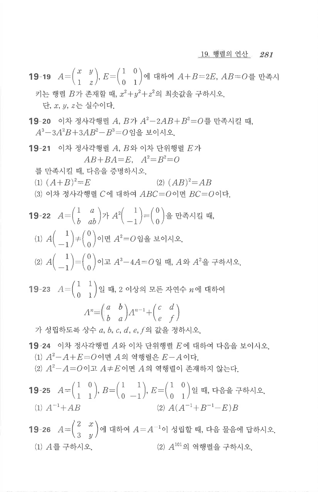

# 연습문제 19-22

## 문제

$$A=\begin{pmatrix}1&a\\b&ab\end{pmatrix}$$
가
$$A^2\begin{pmatrix}1\\-1\end{pmatrix}=\begin{pmatrix}0\\0\end{pmatrix}$$
을 만족시킬 때,

1. $A\begin{pmatrix}1\\-1\end{pmatrix}\ne\begin{pmatrix}0\\0\end{pmatrix}$이면 $A^2=O$임을 보이시오.
2. $A\begin{pmatrix}1\\-1\end{pmatrix}=\begin{pmatrix}0\\0\end{pmatrix}$이고 $A^3-4A=O$일 때, $A$와 $A^2$을 구하시오.

## 원문

