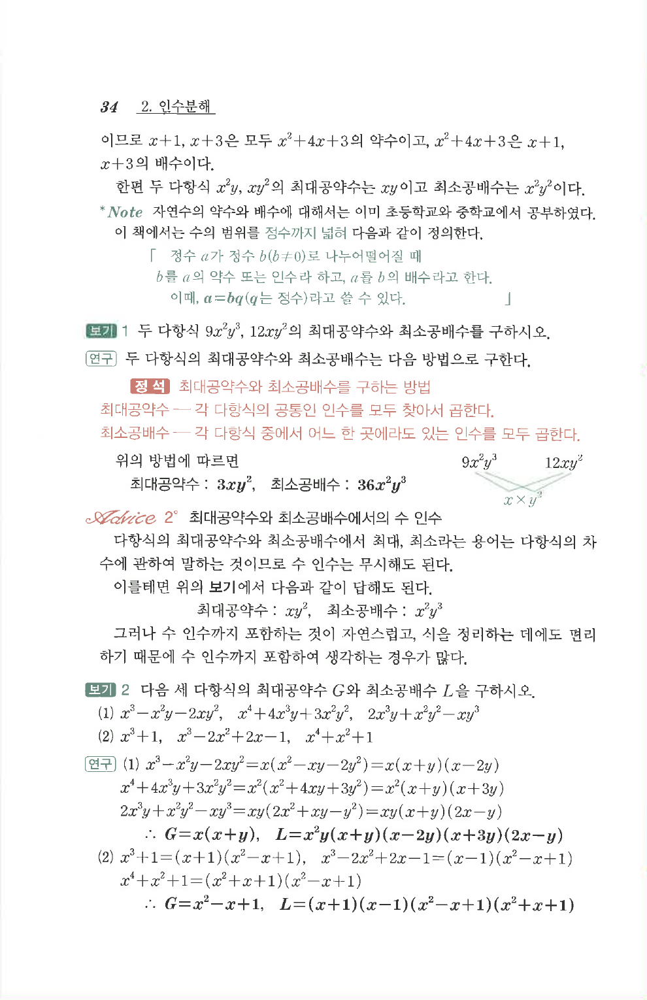

# S3 보기 2

## 문제

다음 세 다항식의 최대공약수 $G$와 최소공배수 $L$을 구하시오.

1. $$x^3-x^2y-2xy^2,\quad x^4+4x^3y+3x^2y^2,\quad 2x^3y+x^2y^2-xy^3$$
2. $$x^3+1,\quad x^3-2x^2+2x-1,\quad x^4+x^2+1$$

## 정답

1. $$G=x(x+y),\quad L=x^2y(x+y)(x-2y)(x+3y)(2x-y)$$
2. $$G=x^2-x+1,\quad L=(x+1)(x-1)(x^2-x+1)(x^2+x+1)$$

## 원문

