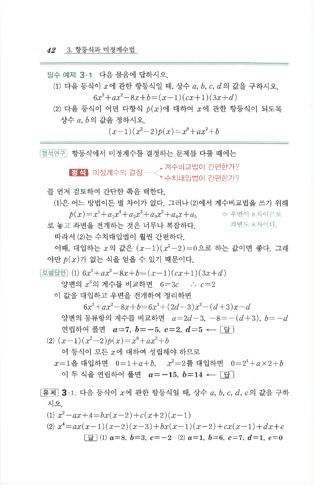

# 필수 예제 3-1

## 문제

다음 물음에 답하시오.

1. 다음 등식이 $x$에 관한 항등식일 때, 상수 $a,b,c,d$의 값을 구하시오.

   $$6x^3+ax^2-8x+b=(x-1)(cx+1)(3x+d)$$

2. 다음 등식이 어떤 다항식 $p(x)$에 대하여 $x$에 관한 항등식이 되도록 상수 $a,b$의 값을 정하시오.

   $$(x-1)(x^2-2)p(x)=x^8+ax^2+b$$

## 정답

1. $$a=7, b=-5, c=2, d=5$$
2. $$a=-15, b=14$$

## 원문

