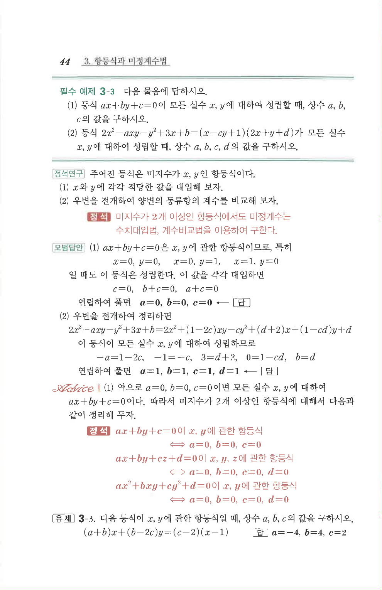

# 필수 예제 3-3

## 문제

다음 물음에 답하시오.

1. 등식 $ax+by+c=0$이 모든 실수 $x,y$에 대하여 성립할 때, 상수 $a,b,c$의 값을 구하시오.
2. 등식

   $$2x^2-axy-y^2+3x+b=(x-cy+1)(2x+y+d)$$

   가 모든 실수 $x,y$에 대하여 성립할 때, 상수 $a,b,c,d$의 값을 구하시오.

## 정답

1. $$a=0, b=0, c=0$$
2. $$a=1, b=1, c=1, d=1$$

## 원문

