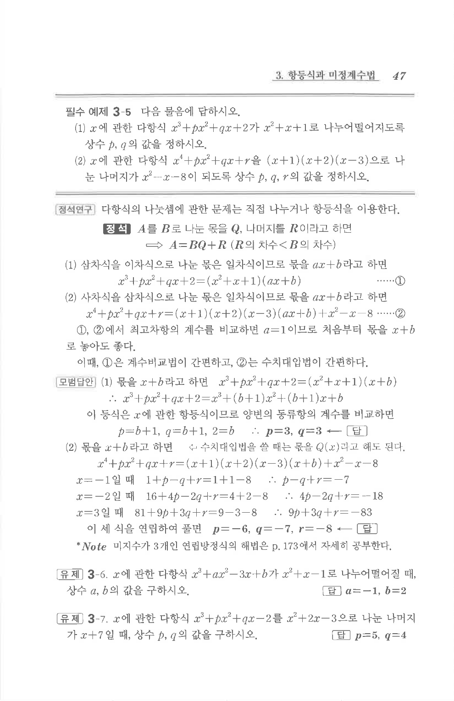

# 필수 예제 3-5

## 문제

다음 물음에 답하시오.

1. $x$에 관한 다항식 $x^3+px^2+qx+2$가 $x^2+x+1$로 나누어떨어지도록 상수 $p,q$의 값을 정하시오.
2. $x$에 관한 다항식 $x^4+px^2+qx+r$을 $(x+1)(x+2)(x-3)$으로 나눈 나머지가 $x^2-x-8$이 되도록 상수 $p,q,r$의 값을 정하시오.

## 정답

1. $$p=3, q=3$$
2. $$p=-6, q=-7, r=-8$$

## 원문

