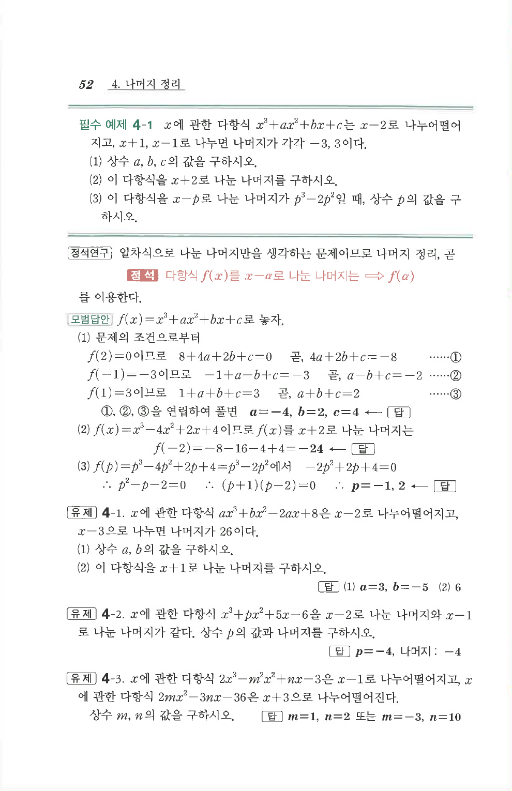

# 필수 예제 4-1

## 문제

$x$에 관한 다항식 $x^3+ax^2+bx+c$는 $x-2$로 나누어떨어지고, $x+1$, $x-1$로 나누면 나머지가 각각 $-3$, $3$이다.

1. 상수 $a,b,c$의 값을 구하시오.
2. 이 다항식을 $x+2$로 나눈 나머지를 구하시오.
3. 이 다항식을 $x-p$로 나눈 나머지가 $p^3-2p^2$일 때, 상수 $p$의 값을 구하시오.

## 정답

1. $$a=-4,\ b=2,\ c=4$$
2. $$-24$$
3. $$p=-1,\ 2$$

## 원문

