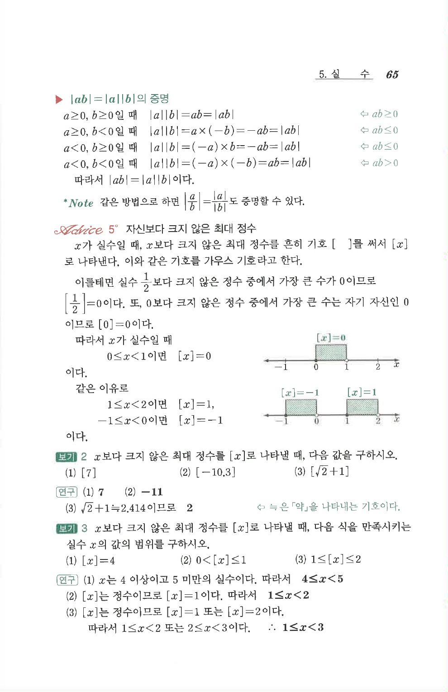

# S1 보기 3

## 문제

$x$보다 크지 않은 최대 정수를 $[x]$로 나타낼 때, 다음 식을 만족시키는 실수 $x$의 값의 범위를 구하시오.

1. $$[x]=4$$
2. $$0<[x]\le1$$
3. $$1\le[x]\le2$$

## 정답

1. $$4\le x<5$$
2. $$1\le x<2$$
3. $$1\le x<3$$

## 원문

