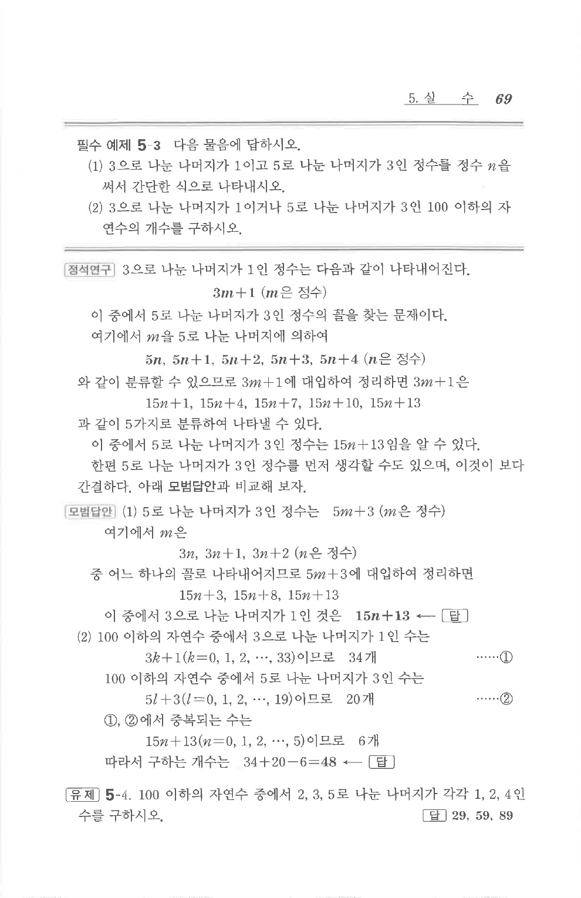

# 필수 예제 5-3

## 문제

다음 물음에 답하시오.

1. $3$으로 나눈 나머지가 $1$이고 $5$로 나눈 나머지가 $3$인 정수를 정수 $n$을 써서 간단한 식으로 나타내시오.
2. $3$으로 나눈 나머지가 $1$이거나 $5$로 나눈 나머지가 $3$인 $100$ 이하의 자연수의 개수를 구하시오.

## 정답

1. $$15n+13\quad(n\text{은 정수})$$
2. $$48$$

## 원문

