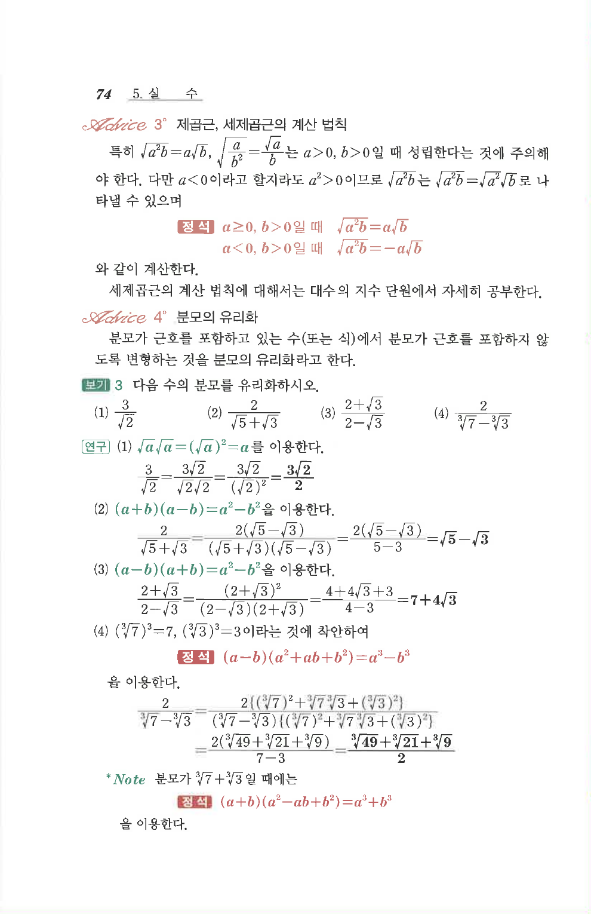

# S3 보기 3

## 문제

다음 수의 분모를 유리화하시오.

1. $$\frac{3}{\sqrt2}$$
2. $$\frac{2}{\sqrt5+\sqrt3}$$
3. $$\frac{2+\sqrt3}{2-\sqrt3}$$
4. $$\frac{2}{\sqrt[3]{7}-\sqrt[3]{3}}$$

## 정답

1. $$\frac{3\sqrt2}{2}$$
2. $$\sqrt5-\sqrt3$$
3. $$7+4\sqrt3$$
4. $$\frac{\sqrt[3]{49}+\sqrt[3]{21}+\sqrt[3]{9}}{2}$$

## 원문

