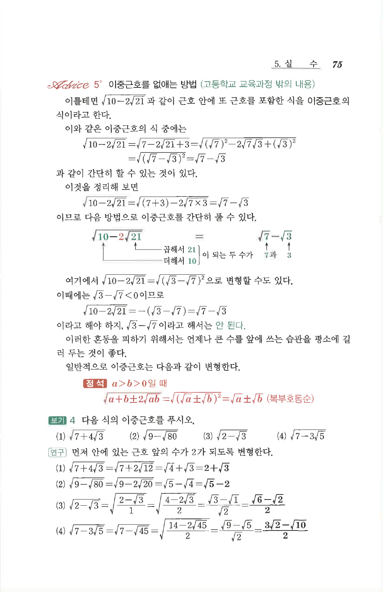

# S3 보기 4

## 문제

다음 식의 이중근호를 푸시오.

1. $$\sqrt{7+4\sqrt3}$$
2. $$\sqrt{9-\sqrt{80}}$$
3. $$\sqrt{2-\sqrt3}$$
4. $$\sqrt{7-3\sqrt5}$$

## 정답

1. $$2+\sqrt3$$
2. $$\sqrt5-2$$
3. $$\frac{\sqrt6-\sqrt2}{2}$$
4. $$\frac{3\sqrt2-\sqrt{10}}{2}$$

## 원문

