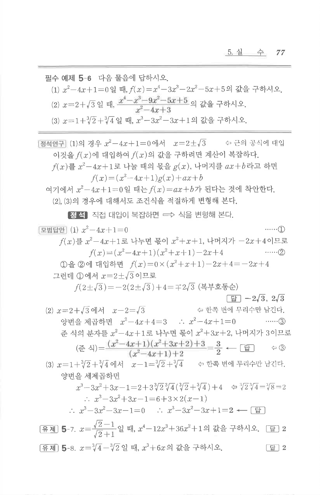

# 필수 예제 5-6

## 문제

다음 물음에 답하시오.

1. $x^2-4x+1=0$일 때, $f(x)=x^4-3x^3-2x^2-5x+5$의 값을 구하시오.
2. $x=2+\sqrt3$일 때, $$\frac{x^4-x^3-9x^2-5x+5}{x^2-4x+3}$$의 값을 구하시오.
3. $x=1+\sqrt[3]{2}+\sqrt[3]{4}$일 때, $x^3-3x^2-3x+1$의 값을 구하시오.

## 정답

1. $$-2\sqrt3,\ 2\sqrt3$$
2. $$\frac32$$
3. $$2$$

## 원문

