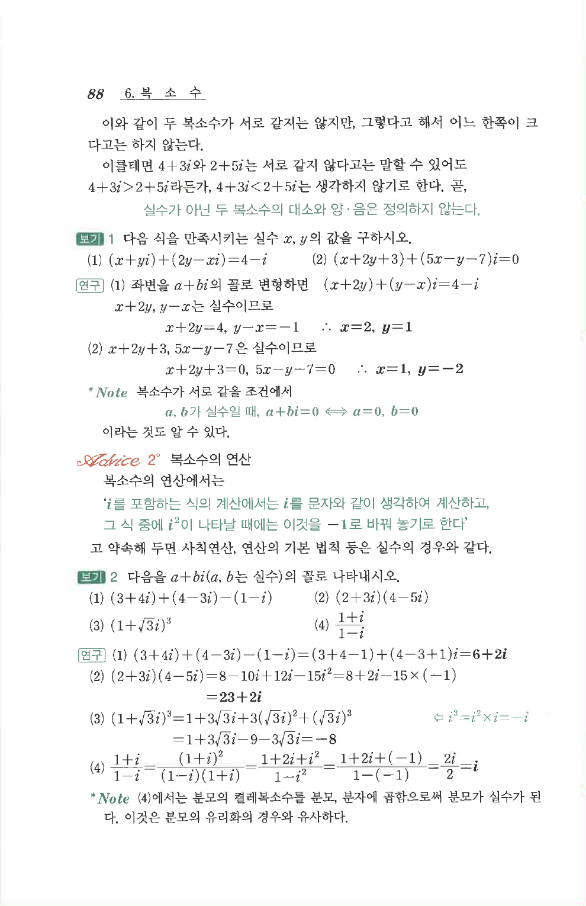

# S2 보기 2

## 문제

다음을 $a+bi\ (a,b\text{는 실수})$의 꼴로 나타내시오.

1. $(3+4i)+(4-3i)-(1-i)$
2. $(2+3i)(4-5i)$
3. $(1+\sqrt3 i)^3$
4. $\dfrac{1+i}{1-i}$

## 정답

1. $6+2i$
2. $23+2i$
3. $-8$
4. $i$

## 원문 문제

## 원문

