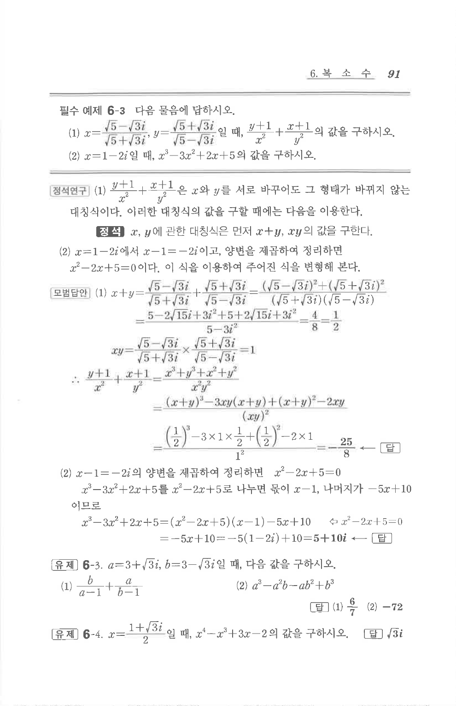

# 필수 예제 6-3

## 문제

다음 물음에 답하시오.

1. $x=\dfrac{\sqrt5-\sqrt3 i}{\sqrt5+\sqrt3 i},\ y=\dfrac{\sqrt5+\sqrt3 i}{\sqrt5-\sqrt3 i}$일 때, $\dfrac{y+1}{x^2}+\dfrac{x+1}{y^2}$의 값을 구하시오.
2. $x=1-2i$일 때, $x^3-3x^2+2x+5$의 값을 구하시오.

## 정답

1. $-\dfrac{25}{8}$
2. $5+10i$

## 원문 문제

## 원문

