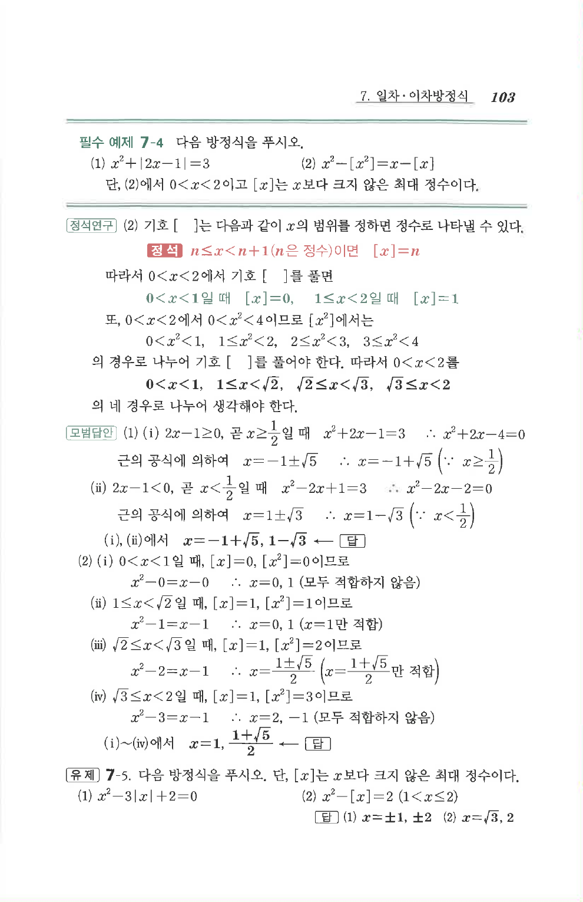

# 필수 예제 7-4

## 문제

다음 방정식을 푸시오.

1. $x^2+|2x-1|=3$
2. $x^2-[x^2]=x-[x]$

단, (2)에서 $0<x<2$이고, $[x]$는 $x$보다 크지 않은 최대 정수이다.

## 정답

1. $x=-1+\sqrt5,\ 1-\sqrt3$
2. $x=1,\ \dfrac{1+\sqrt5}{2}$

## 원문 문제

## 원문

