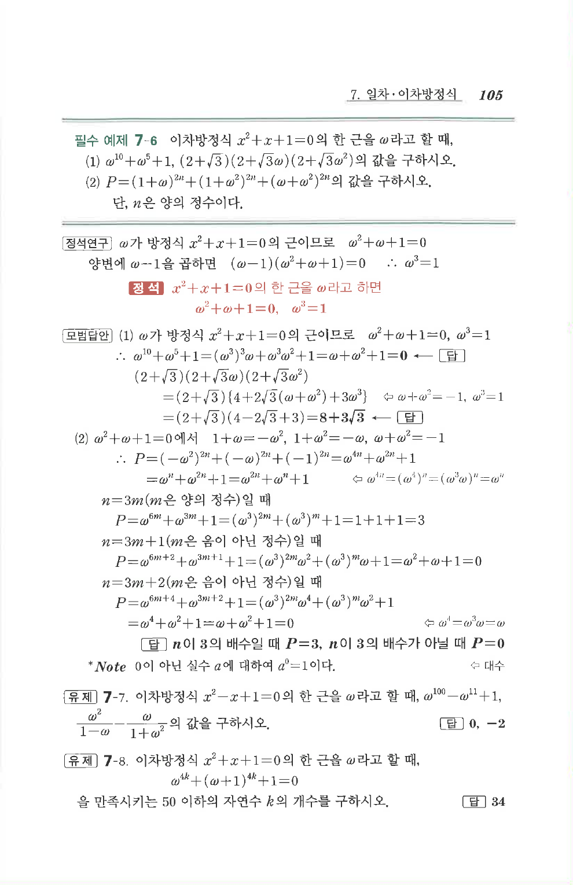

# 필수 예제 7-6

## 문제

이차방정식 $x^2+x+1=0$의 한 근을 $\omega$라고 할 때, 다음 값을 구하시오.

1. $\omega^{10}+\omega^5+1$, $(2+\sqrt3)(2+\sqrt3\omega)(2+\sqrt3\omega^2)$
2. $P=(1+\omega)^{2n}+(1+\omega^2)^{2n}+(\omega+\omega^2)^{2n}$

단, $n$은 양의 정수이다.

## 정답

1. $0$, $8+3\sqrt3$
2. $n$이 $3$의 배수일 때 $P=3$, $n$이 $3$의 배수가 아닐 때 $P=0$

## 원문 문제

## 원문

