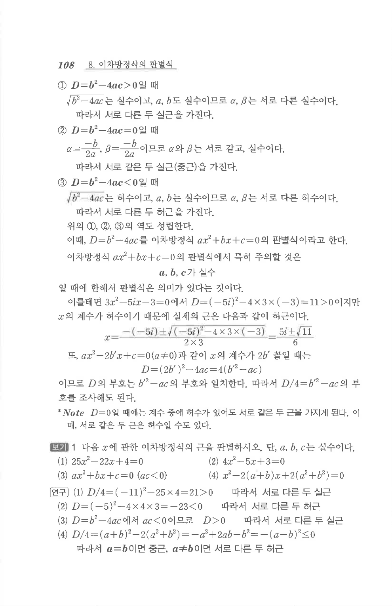

# S1 보기 1

## 문제

다음 $x$에 관한 이차방정식의 근을 판별하시오. 단, $a,b,c$는 실수이다.

1. $25x^2-22x+4=0$
2. $4x^2-5x+3=0$
3. $ax^2+bx+c=0\quad(ac<0)$
4. $x^2-2(a+b)x+2(a^2+b^2)=0$

## 정답

1. 서로 다른 두 실근
2. 서로 다른 두 허근
3. 서로 다른 두 실근
4. $a=b$이면 중근, $a\ne b$이면 서로 다른 두 허근

## 원문 문제

## 원문

