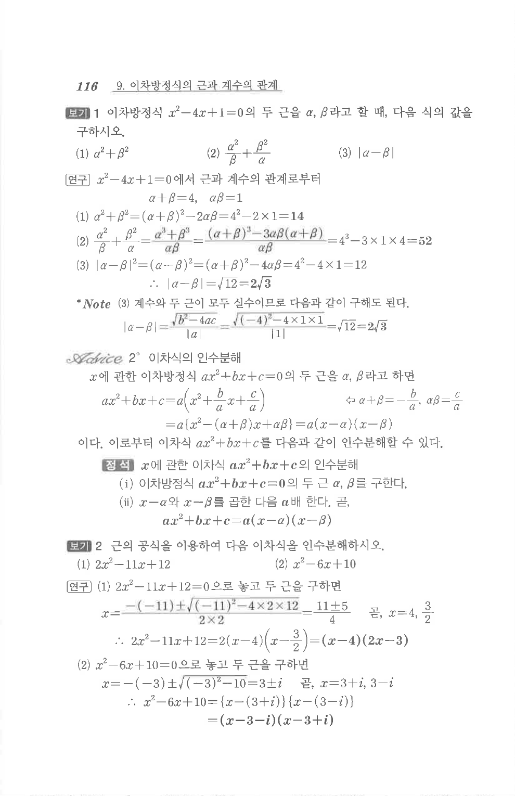

# S1 보기 1

## 문제

이차방정식 $x^2-4x+1=0$의 두 근을 $\alpha, \beta$라고 할 때, 다음 식의 값을 구하시오.

1. $\alpha^2+\beta^2$
2. $\dfrac{\alpha^2}{\beta}+\dfrac{\beta^2}{\alpha}$
3. $|\alpha-\beta|$

## 정답

1. $14$
2. $52$
3. $2\sqrt3$

## 원문

