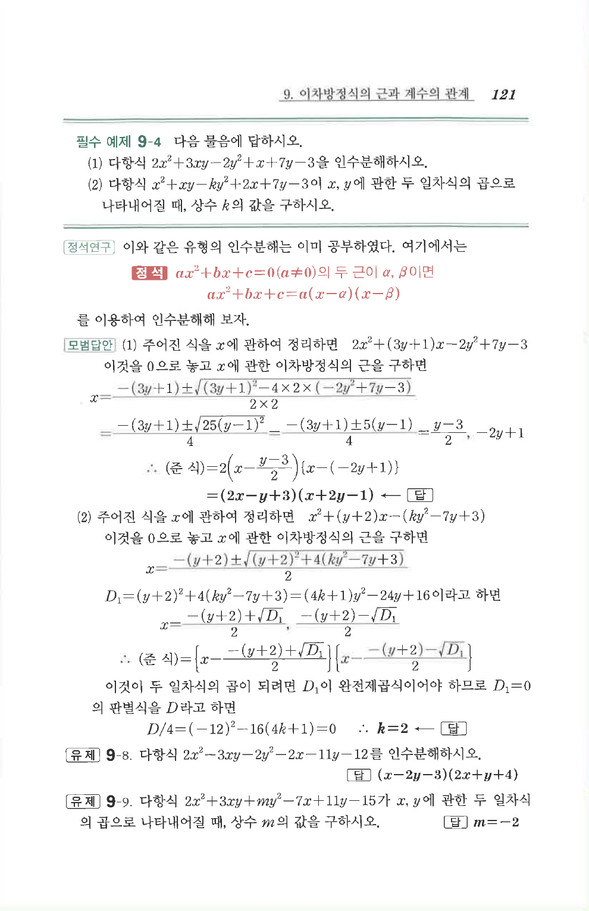

# 필수 예제 9-4

## 문제

다음 물음에 답하시오.

1. 다항식 $2x^2+3xy-2y^2+x+7y-3$을 인수분해하시오.
2. 다항식 $x^2+xy-ky^2+2x+7y-3$이 $x,y$에 관한 두 일차식의 곱으로 나타내어질 때, 상수 $k$의 값을 구하시오.

## 정답

1. $(2x-y+3)(x+2y-1)$
2. $k=2$

## 원문 문제

## 원문

