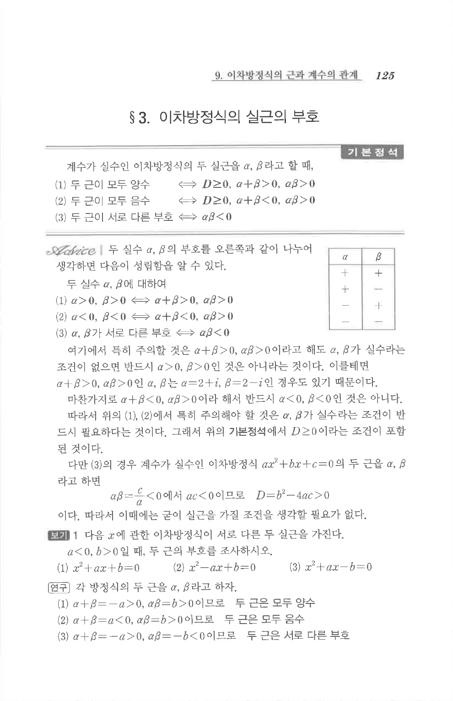

# S3 보기 1

## 문제

다음 $x$에 관한 이차방정식이 서로 다른 두 실근을 가진다. $a<0, b>0$일 때, 두 근의 부호를 조사하시오.

1. $x^2+ax+b=0$
2. $x^2-ax+b=0$
3. $x^2+ax-b=0$

## 정답

1. 두 근은 모두 양수
2. 두 근은 모두 음수
3. 두 근은 서로 다른 부호

## 원문 문제

## 원문

