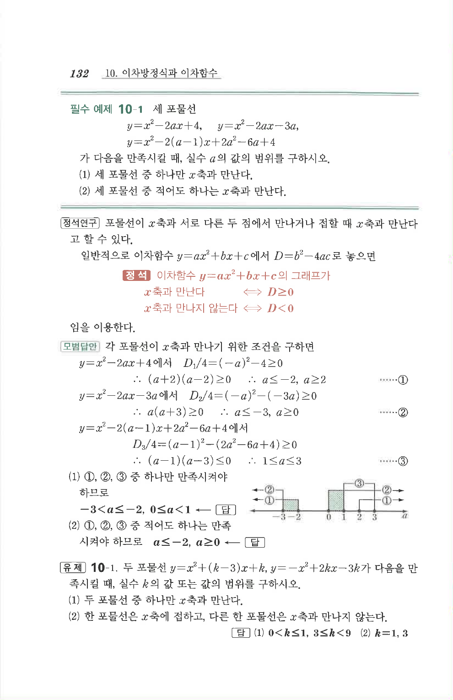

# 필수 예제 10-1

## 문제

세 포물선

$$y=x^2-2ax+4,\qquad y=x^2-2ax-3a,$$

$$y=x^2-2(a-1)x+2a^2-6a+4$$

가 다음을 만족시킬 때, 실수 $a$의 값의 범위를 구하시오.

1. 세 포물선 중 하나만 $x$축과 만난다.
2. 세 포물선 중 적어도 하나는 $x$축과 만난다.

## 정답

1. $-3<a\le -2$, $0\le a<1$
2. $a\le -2$, $a\ge 0$

## 원문 문제

## 원문

