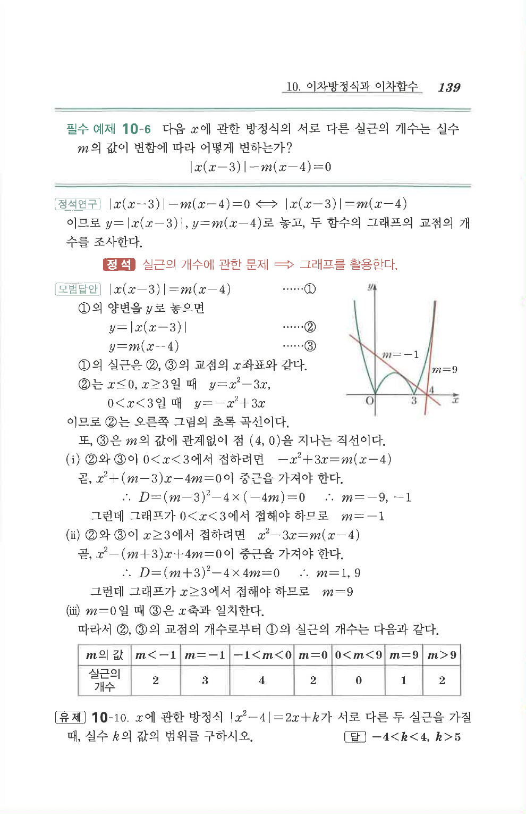

# 필수 예제 10-6

## 문제

다음 $x$에 관한 방정식의 서로 다른 실근의 개수는 실수 $m$의 값이 변함에 따라 어떻게 변하는가?

$$|x(x-3)|-m(x-4)=0$$

## 정답

| $m$의 값 | $m<-1$ | $m=-1$ | $-1<m<0$ | $m=0$ | $0<m<9$ | $m=9$ | $m>9$ |
|---|---:|---:|---:|---:|---:|---:|---:|
| 실근의 개수 | $2$ | $3$ | $4$ | $2$ | $0$ | $1$ | $2$ |

## 원문 문제

## 원문

