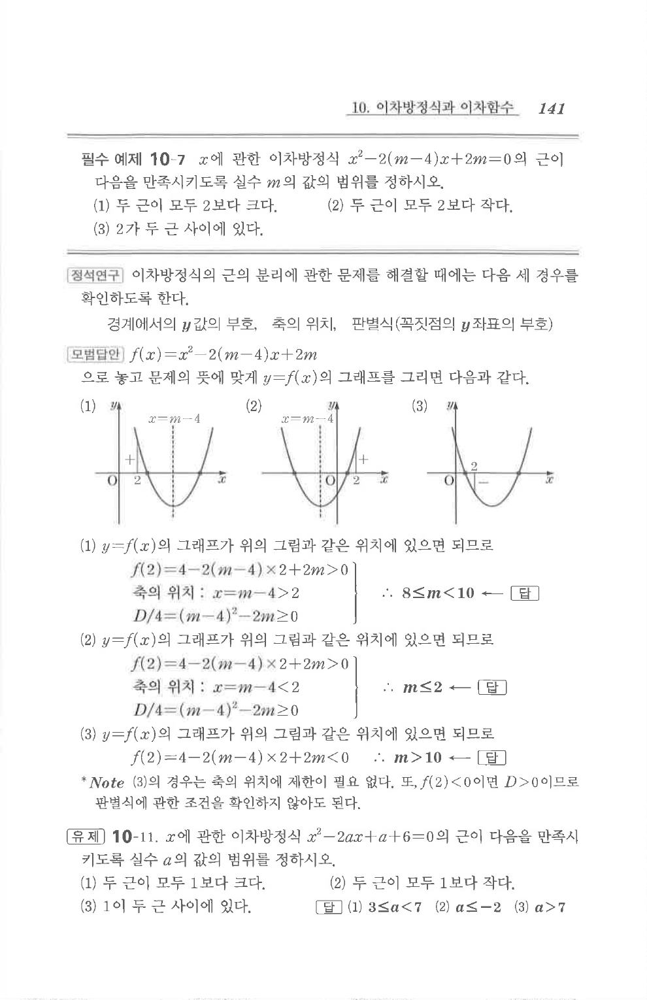

# 필수 예제 10-7

## 문제

$x$에 관한 이차방정식

$$x^2-2(m-4)x+2m=0$$

의 근이 다음을 만족시키도록 실수 $m$의 값의 범위를 정하시오.

1. 두 근이 모두 $2$보다 크다.
2. 두 근이 모두 $2$보다 작다.
3. $2$가 두 근 사이에 있다.

## 정답

1. $8\le m<10$
2. $m\le 2$
3. $m>10$

## 원문 문제

## 원문

