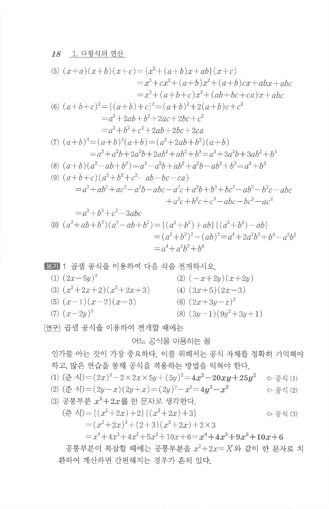
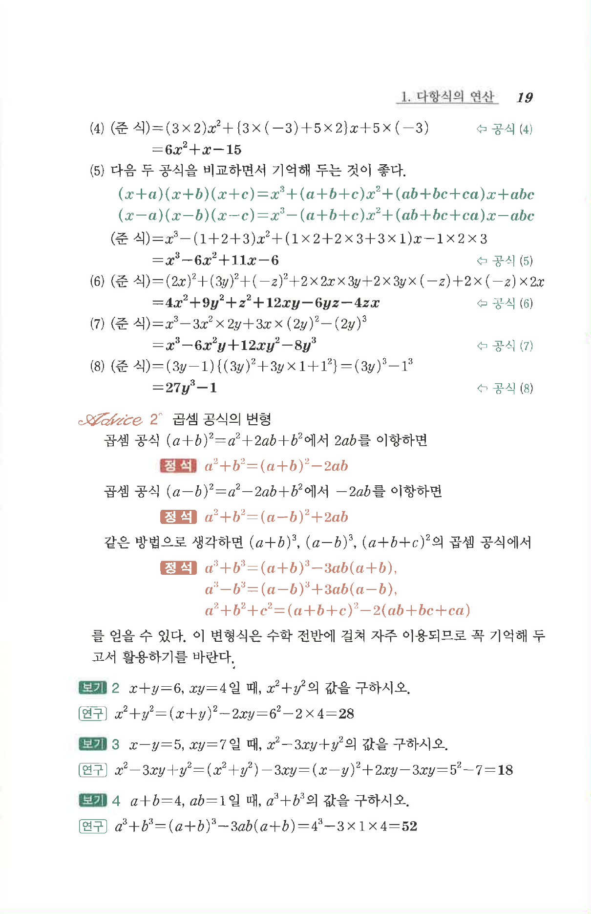

# §2 보기 1

## 문제

곱셈 공식을 이용하여 다음 식을 전개하시오.

1. $$(2x-5y)^2$$
2. $$(-x+2y)(x+2y)$$
3. $$(x^2+2x+2)(x^2+2x+3)$$
4. $$(3x-5)(2x-3)$$
5. $$(x-1)(x-2)(x-3)$$
6. $$(2x+3y-z)^2$$
7. $$(x-2y)^3$$
8. $$(3y-1)(9y^2+3y+1)$$

## 정답

1. $$4x^2-20xy+25y^2$$
2. $$4y^2-x^2$$
3. $$x^4+4x^3+9x^2+10x+6$$
4. $$6x^2+x-15$$
5. $$x^3-6x^2+11x-6$$
6. $$4x^2+9y^2+z^2+12xy-6yz-4zx$$
7. $$x^3-6x^2y+12xy^2-8y^3$$
8. $$27y^3-1$$

## 원문

